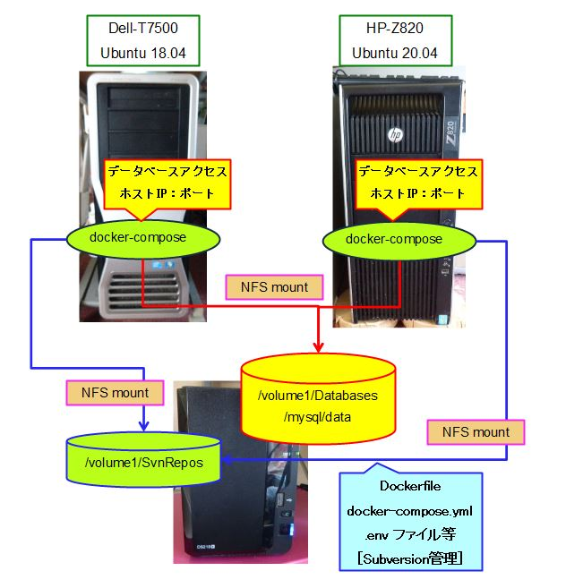
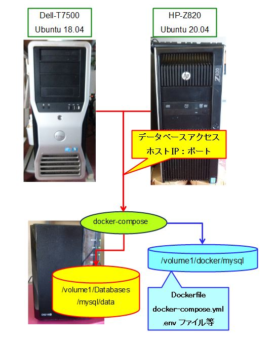

# Synology NAS の活用

Synology NAS(DS218+) を購入したのは3年前。**LinuxベースのNAS**ということが決め手になって購入。

当初は２台のワークステーション(Ubuntu)の共有ストレージとしての機能しか使っていませんでしたが、最近なってNASにいろいろなバッケージを導入することでもっと活用できることがわかりました。

今回は下記に示す現行システムの重複を解消すべく NASに**Dockerパッケージを導入し**マイグレーションする方法を公開いたします。

Dockerの導入と、マイグレーションについての詳細は一番下のリンクからご覧ください。

## 1. NASに docker を導入し現行システムをマイグレーション
---

### 1-1. 現行システム

* NASに現在稼働中のデータベース(MySQL, PostgreSQL)が存在します
* 各ワークステーションの docker-compose を廃止し、NAS上で docker-compose を稼働させます

<div style="text-align:center;">

</div>
<br/>

【Dell-T7500側のNFSマウント】

/etc/fstabの一部抜粋: "192.168.yyy.xxx" は Synology NAS のIPアドレス
```
192.168.yyy.xxx:/volume1/Databases /mnt/nas_databases nfs4 noauto,x-systemd.automount,x-systemd.device-timeout=30,_netdev 0 0
192.168.yyy.xxx:/volume1/SvnRepos /mnt/SvnRepos nfs4 noauto,x-systemd.automount,x-systemd.device-timeout=30,_netdev 0 0
```

### 1-2. マイグレーション後のシステム

* アプリケーションからのデータベースアクセスは、ＮＡＳのＩＰアドレスとdocker-composeでエクスポートしているポートだけとなりました

<div style="text-align:center;">

</div>
<br/>

 [**>>> Synology NAS(DS218+)にdockerを導入** ページへ](migrate_nas_docker/README.md)
