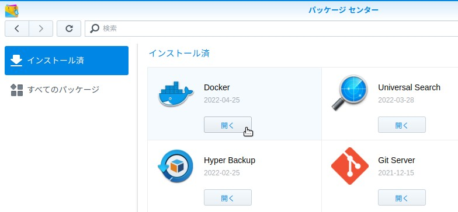

# Synology NAS(DS218+)にdockerを導入

### [[ 参考サイト ]]
英語サイトになりますがほとんどこのサイトの内容を参考にさせていただきました  
 **Thank you very much !!**  
<https://linuxhint.com/docker-compose-with-synology/>  
**How Do I Use Docker Compose with Synology?**


## 1. 事前準備

### 1-1. Dockerパッケージのインストール

* パッケージセンターを開き、[すべてのバッケージ] から [Docker]を見つけインストールする
* 下記画面はパッケージセンターから[インストール済] のパッケージを表示したもの

<div style="text-align:center;">

</div>
<br/>

### 1-2. SSHの有効化

* (1) [端末とSNMP] をクリック
* (2) [ターミナル]タブで、**"SSHサービスを有効にする"にチェックを入れポート番号を入力します(必須)**  
※docker 又は docker-composeでコンテナを作成するにはNASにSSHでログインして実行する必要があります

<div style="text-align:center;">

</div>
<br/>

### 1-3. Dockerを管理するユーザをadministratorsグループに追加する

* 今回はユーザ"developer"をDockerを管理するユーザとして話をすすめます
* ユーザ"developer"をadministratorsグループに追加します  
※**administratorsグループ属さないユーザーはSSHでNASにログインできません**

<div style="text-align:center;">

</div>
<br/>

* ユーザ"developer"でログインしidを確認したところ

<div style="text-align:center;">

</div>
<br/>

### 1-4. dockerディレクトリ直下のサブディレクトリは管理画面から作成します

* パスは **"/volume1/docker"** となります
* 今回マイグレーション対象のデータベースとして下記サブディレクトリを作成します  
  (1) **MySQL-8 用: mysql**  
  (2) **Postgresql-11 用: postgresql/11**

<div style="text-align:center;">

</div>
<br/>

* ユーザ"developer"でログインしdockerディレクトリ直下を確認したところ

<div style="text-align:center;">

</div>
<br/>

### 1-5. ユーザーホームディレクトリ

* SSHでログインし、ターミナルからディレクトリを作成します
* SQLファイルなどを格納します

<div style="text-align:center;">

</div>
<br/>

* ユーザ"developer"のホームディレクトリを確認したところ  
  /var/services/homes/**developer**

<div style="text-align:center;">

</div>
<br/>

**>> 以降 NASにSSHでログインしコンソールでの作業になります**

## 2. docker-composeの実行環境構築

### 2-1. dockerパッケージインストール後の確認作業

* バージョンの確認 ※**先頭にsudoは不要**

```bash
developer@syn-ds218p:~$ docker --version
Docker version 20.10.3, build b35e731

developer@syn-ds218p:~$ docker-compose --version
docker-compose version 1.28.5, build 1bbbad71
```

### 2-2. マイグレーションプロジェクト

* 開発用ワークステーション (Dell-T7500) のdockerディレクトリツリー
  * ★ Dell-T7500 ワークステーションで管理し、**今回NAS側にマイグレーションするプロジェクト**
  * ■ HP-Z820ワークステーションで管理するプロジェクト  
     ※**GPUとしてTesla-k20**を搭載するワークステーションで、主に機械学習・デープラーニング用途で使用

```
docker
├── compose
│   ├── cassandra-cluster
│   │   ├── Dockerfile
│   │   ├── cassandra.env
│   │   ├── docker-compose.yml
│   │   ├── docker-entrypoint.sh
│   │   └── initdb.d
│   │       └── init_keyspace.sql
│ ■├── graphviz
│   │   ├── Dockerfile
│   │   ├── docker-compose.yml
│   │   └── docker_run.txt
│ ■├── ml
│   │   ├── Dockerfile-db
│   │   ├── Dockerfile-jupyter
│   │   ├── docker-compose.yml
│   │   ├── input_data
│   │   │   └── iris.csv
│   │   └── scripts
│   │       └── initdb
│   │           ├── 01_init_database.sql
│   │           └── 02_init_tables.sql
│ ★├── mysql
│   │   └── 8.0
│   │       ├── Dockerfile
│   │       ├── compose_mysql8
│   │       ├── config
│   │       │   ├── conf.d
│   │       │   │   └── docker.cnf
│   │       │   └── my.cnf
│   │       ├── docker-compose.yml
│   │       └── initdb
│   │           └── create_mylearn.sql
│   ├── postgres
│   │ ★├── 11
│   │   │   ├── Dockerfile
│   │   │   ├── docker-compose.yml
│   │   │   └── initdb
│   │   │       └── createdb_mylearn.sql
│   │   └── 13
│   │       ├── Dockerfile
│   │       ├── docker-compose.yml
│   │       └── initdb
│   │           └── createdb_weather.sql
│   └── tomcat
│        ...一部省略...
└── scripts
    ├── rm_container.sh
    ├── run_mysql.sh
    └── run_postgres.sh
```

### 2-3. 開発用ワークステーションでマイグレーション対象のファイルを編集

以降マイグレーションパスを "~/docker/SynologyNAS/compose/mysql" とします  
マイグレーション対象ファイルは **docker-compose.yml** のみとなります

* (1) オリジナル: docker-compose.yml

```
version: '3'
services:
  mysql:
    build: .
    container_name: mysql-8
    ports:
      - "3306:3306"
    volumes:
      - "/mnt/nas_databases/mysql-8.0:/var/lib/mysql"
      - "/home/yukio/Examples/data/sql:/home/yukio/sql"
      - "./config/my.cnf:/etc/mysql/my.cnf"
    environment:
      - MYSQL_ROOT_PASSWORD=yourpassword
```

* (2) 修正後: docker-compose.yml

    変更箇所はボリュームのみとなります  
    ★1 **/mnt/nas_databases** (NFSマウントディレクトリ) => **/volume1/Databases**  
    ★2 ./config/my.cnf => **/volume1/docker/mysql/config/my.cnf**  
    ★3 /home/yukio/Examples/data/sql => **/var/services/homes/developer/sql**

```
    volumes:
      - "/volume1/Databases/mysql-8.0:/var/lib/mysql"            ★1
      - "/volume1/docker/mysql/config/my.cnf:/etc/mysql/my.cnf"  ★2
      - "/var/services/homes/developer/sql:/home/yukio/sql"      ★3
```

### 2-4. NAS側にマイグレーションするファイルをコピー

* (1) ユーザ "developer" でログイン  
   ※**以降、パスワード入力プロンプトは省略しています**

```bash
yukio@Dell-T7500:~$ ssh -p???? developer@192.168.xxx.yyy
developer@syn-ds218p:~$ pwd
/var/services/homes/developer
```

* (2) 開発用ワークステーションから編集済みのファイルとディレクトリをdockerボリュームにコピーする

```bash
$ cd /volume1/docker/mysql
$ scp yukio@192.168.0.101:~/docker/SynologyNAS/compose/mysql/Dockerfile .
$ scp yukio@192.168.0.101:~/docker/SynologyNAS/compose/mysql/docker-compose.yml .
$ scp -r yukio@192.168.0.101:~/docker/SynologyNAS/compose/mysql/config .
$ scp -r yukio@192.168.0.101:~/docker/SynologyNAS/compose/mysql/initdb .

$ ls -l
total 8
drwxrwxr-x  1 developer users  24 Apr 26 15:37 config
-rwxrwxrwx+ 1 developer users 356 Apr 26 15:55 docker-compose.yml
-rwxrwxrwx+ 1 developer users  91 Apr 26 15:55 Dockerfile
drwxrwxr-x  1 developer users  36 Apr 26 16:02 initdb
```

* (3) 開発用ワークステーションからSQLディレクトリ(~/Examples/data/sql/mysql)まるごとコピーする  
  ※ **yamlに記載されているボリュームはビルド時には全て存在しなければなりません**

```bash
$ cd /var/services/homes/developer
$ scp -r yukio@192.168.0.101:~/Examples/data/sql/mysql .
```

### 2-5. docker-compose コマンドでビルド

* (1) 先頭に **sudo** を付けて実行

```bash
developer@syn-ds218p:/volume1/docker/mysql$ sudo docker-compose up -d
Building mysql
Sending build context to Docker daemon   7.68kB

Step 1/3 : FROM mysql:latest
latest: Pulling from library/mysql
4be315f6562f: Pulling fs layer
96e2eb237a1b: Pulling fs layer
8aa3ac85066b: Pulling fs layer
ac7e524f6c89: Pulling fs layer
# ...一部省略...
Step 1/3 : FROM mysql:latest
 ---> f2ad9f23df82
Step 2/3 : COPY config/ /etc/mysql/
 ---> Using cache
 ---> 7d0cfb6b1833
Step 3/3 : COPY initdb/*.sql /docker-entrypoint-initdb.d/
 ---> 601a8a2d965a
Successfully built 601a8a2d965a
Successfully tagged mysql_mysql:latest
# ...一部省略...
Creating mysql_default ... done
```

* (2) mysqlクライアントにログインして既存のテーブル内容を確認  
  ※1 **sudo docker exec -it mysql-8 bin/bash**  
  ※2 データベース: **mylearn**

```bash
developer@syn-ds218p:/volume1/docker/mysql$ sudo docker exec -it mysql-8 bin/bash
Password: 
root@eb9d1b097a4e:/# cd /home/yukio/sql
root@eb9d1b097a4e:/home/yukio/sql# ls -l
total 0
drwxrwxr-x 1 1027 users 206 Apr 26 06:27 mysql
drwxr-xr-x 1 1027 users   0 Apr 26 06:24 postgresql
root@eb9d1b097a4e:/home/yukio/sql# cd mysql/
root@eb9d1b097a4e:/home/yukio/sql/mysql# ls -l
total 20
-rw-r--r-- 1 1027 users  390 Apr 26 06:27 category.csv
-rw-r--r-- 1 1027 users 1020 Apr 26 06:27 create_knowhow.sql
-rw-r--r-- 1 1027 users   79 Apr 26 06:27 create_knowhow_index.sql
-rw-r--r-- 1 1027 users  743 Apr 26 06:27 create_knowhow_orginal.sql
-rw-r--r-- 1 1027 users  188 Apr 26 06:27 import_category_csv.sql

root@eb9d1b097a4e:/home/yukio/sql/mysql# mysql -udeveloper -p
Enter password: 
# ...一部省略...
mysql> use mylearn
Reading table information for completion of table and column names
You can turn off this feature to get a quicker startup with -A

Database changed
mysql> desc knowhow;
+-------------+-------------------+------+-----+---------+----------------+
| Field       | Type              | Null | Key | Default | Extra          |
+-------------+-------------------+------+-----+---------+----------------+
| id          | int unsigned      | NO   | PRI | NULL    | auto_increment |
| category_id | smallint unsigned | NO   | MUL | NULL    |                |
| title       | varchar(200)      | NO   |     | NULL    |                |
| keyword     | varchar(128)      | NO   | MUL | NULL    |                |
| refer_url   | varchar(256)      | YES  |     | NULL    |                |
| doc_place   | varchar(256)      | YES  |     | NULL    |                |
| content     | text              | YES  |     | NULL    |                |
| content_jp  | text              | YES  | MUL | NULL    |                |
+-------------+-------------------+------+-----+---------+----------------+
8 rows in set (0.01 sec)

mysql> select * from category order by id;
+----+------------------+
| id | name             |
+----+------------------+
|  1 | Android          |
|  2 | Arduino          |
|  3 | C++              |
|  4 | Database         |
#...一部省略...
| 23 | VisualStudioCode |
| 24 | WebApp           |
| 31 | IoT              |
| 32 | 電子工作         |
| 33 | 電子部品         |
| 41 | ドローン         |
| 99 | Others           |
+----+------------------+
29 rows in set (0.00 sec)
```

これでNASへのマイグレーションが問題なく完了しました

**>> これ以降は NASの管理画面からの作業となります**

## 3. タスクスケジューラーでスクリプトを登録する

### 3-1. コントロールパネル - [タスクスケジューラー]

* (1) メニュー [作成] >> **[トリガーされたタスク] >> [ユーザ作成のスクリプト]**

<div style="text-align:center;">

</div>
<br/>

* (2) A-1 **ブートアップ**タスクを作成
  * タスク: "Boot mysql" ※わかり易い内容で
  * ユーザー: developer **※ユーザ"root" だと実行に失敗します**
  * イベント: **ブートアップ**  
  * **[有効]をチェック**

<div style="text-align:center;">

</div>
<br/>

* (2) A-2 タスク設定: ユーザ指定のスクリプト  
  以下は登録するスクリプトの内容

```bash
/usr/local/bin/docker-compose -f /volume1/docker/mysql/docker-compose.yml up -d
```

<div style="text-align:center;">

</div>
<br/>

* (2) B-1 **シャットダウン**タスクを作成
  * タスク名: "Shutdown mysql"
  * ユーザー: developer
  * イベント: **シャットダウン**
  * **[有効]をチェック**

<div style="text-align:center;">

</div>
<br/>

* (2) B-2 タスク設定: ユーザ指定のスクリプト  
  以下は登録するスクリプトの内容

```bash
/usr/local/bin/docker-compose -f /volume1/docker/mysql/docker-compose.yml down
```

<div style="text-align:center;">

</div>
<br/>

* (3).全てのタスクの登録

```
Bootup script
[MySQL]
/usr/local/bin/docker-compose -f /volume1/docker/mysql/docker-compose.yml up -d
[PostgreSQL]
/usr/local/bin/docker-compose -f /volume1/docker/postgresql/11/docker-compose.yml up -d

Shutdown script
[MySQL]
/usr/local/bin/docker-compose -f /volume1/docker/mysql/docker-compose.yml down
[PostgreSQL]
/usr/local/bin/docker-compose -f /volume1/docker/postgresql/11/docker-compose.yml down
```

<div style="text-align:center;">

</div>
<br/>

### 3-2. NASを再起動

* [バッケージセンター] - [インストール済] の **Docker [開く]** 押下

<div style="text-align:center;">

</div>
<br/>

* スクリプトに設定したデータベースコンテナが起動しました

<div style="text-align:center;">

</div>
<br/>

### 3-3. WindowsのデータベースツールからNASのコンテナデータベースにアクセス

* NASのIPアドレスとポートでアクセスできました

<div style="text-align:center;">

</div>
<br/>
